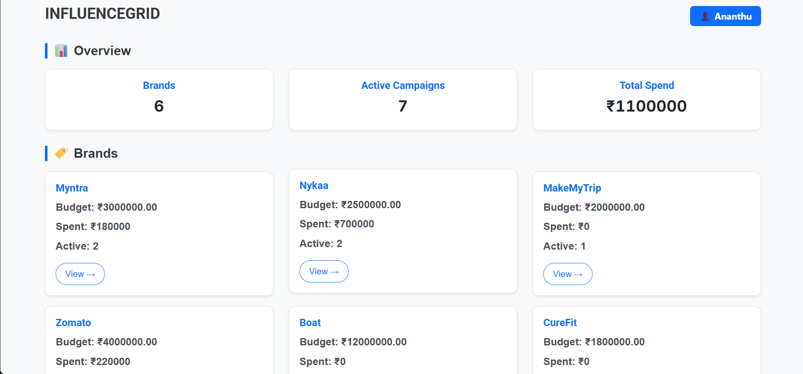
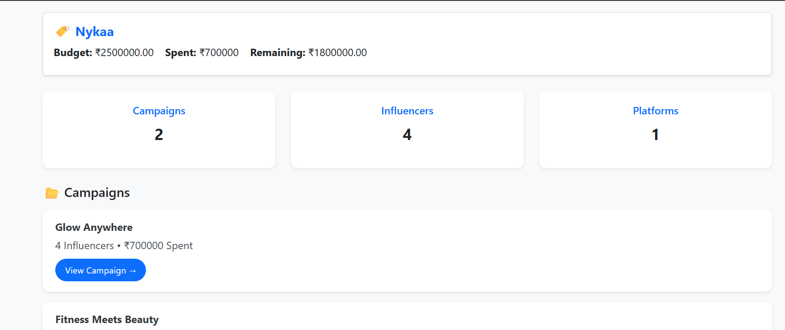
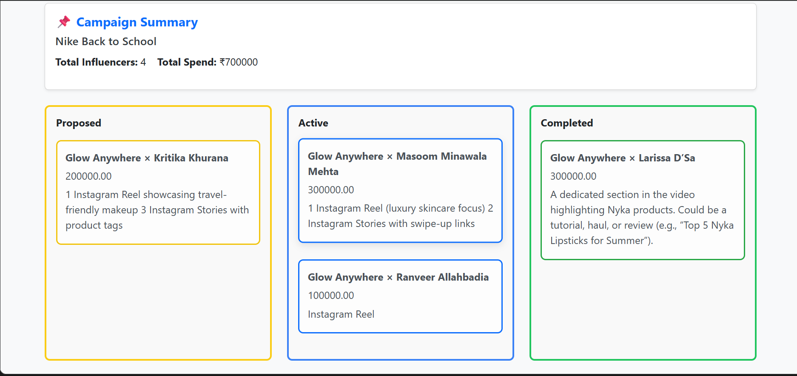

# InfluenceGrid 📊

A robust **CRM & Sponsorship Tracker** built with **Django** and **Tailwind CSS**. 

This application solves the "Spreadsheet Chaos" faced by marketing agencies by normalizing data into a relational database. It moves beyond simple "To-Do" lists by modeling complex, real-world relationships between Brands, Influencers, Platforms, and Contracts.

## 🚀 Key Highlights

* **SaaS-Grade Dashboard:** Real-time aggregation of budgets, spend, and active campaigns using Django's `annotate` and `aggregate` functions.
* **Kanban Workflow:** A Trello-style board to track contract statuses (Proposed → Active → Completed), built purely with Django templates and Tailwind Grid.
* **Complex Data Modeling:** Handles "Many-to-Many" relationships with intermediate data (Fees, Deliverables) to represent real legal contracts.

## 🏗️ Database Architecture (The Core)

This project was built to master **Relational Database Design** in Django. It avoids flat data structures in favor of a normalized, scalable schema.

### 1. The "Connector" Model Strategy
Instead of linking Brands directly to Influencers, the system uses a **Contract-Based Architecture**:

`Brand` ➡ `Campaign` ➡ `CampaignInfluencer` (Contract) ⬅ `Influencer`

* **Why?** A Brand (e.g., Nykaa) might hire the same Influencer (e.g., Kritika) for *multiple* different campaigns over time. A direct link cannot track separate statuses or fees for each event.

### 2. The Models

| Model | Type | Responsibility |
| :--- | :--- | :--- |
| **Brand** | Parent | Holds the "Wallet" (Total Budget). |
| **Campaign** | Container | Groups multiple contracts under one initiative (e.g., "Summer Sale"). |
| **Influencer** | Entity | Represents the human creator. |
| **InfluencerPlatform** | Logic | **Crucial:** Separates the person from the channel. Allows tracking "MKBHD on YouTube" separately from "MKBHD on Twitter". |
| **CampaignInfluencer** | **Pivot** | The **Contract**. Stores the specific `Fee`, `Status`, and `Deliverables` for a single deal. |

### 3. Key Relationships
* **Foreign Keys:** Used to cascade deletes (e.g., Deleting a Campaign deletes its Contracts).
* **Aggregation Logic:** The Dashboard calculates "Total Spent" by summing the `fee` field of all `CampaignInfluencer` records linked to a specific Brand.

## 📸 Application Tour

### 1. The Agency Dashboard
*Aggregates data across all clients. Uses Django ORM to calculate "Total Spend" and count "Active Campaigns" efficiently.*


### 2. Client Overview (Nykaa)
*Drill-down view showing budget utilization and specific campaign lists.*


### 3. Campaign Kanban Board
*Visualizes the lifecycle of contracts. Cards move from "Proposed" to "Completed". Logic distinguishes between "Campaign Niche" and "Influencer Niche".*


## 🛠️ Tech Stack

* **Backend:** Python 3, Django 5 (Stable)
* **Database:** SQLite (Dev) / PostgreSQL (Ready)
* **Frontend:** HTML5, Tailwind CSS (CDN)
* **Utilities:** Django Context Processors (for global search/menus)

## 💻 Installation

1.  **Clone the repo**
    ```bash
    git clone [https://github.com/YOUR_USERNAME/InfluenceGrid-Django-CRM.git](https://github.com/YOUR_USERNAME/InfluenceGrid-Django-CRM.git)
    cd InfluenceGrid-Django-CRM
    ```

2.  **Setup Virtual Environment**
    ```bash
    python -m venv venv
    source venv/bin/activate  # Windows: venv\Scripts\activate
    ```

3.  **Install Dependencies**
    ```bash
    pip install django
    ```

4.  **Migrate & Run**
    ```bash
    python manage.py migrate
    python manage.py runserver
    ```

## 🧠 What I Learned
* **Advanced ORM:** How to use `select_related` to fetch Brand and Influencer data in a single query (avoiding N+1 problems).
* **Data Normalization:** Designing models that scale (e.g., adding a new Platform doesn't require schema changes).
* **Business Logic:** Implementing checks (e.g., Ensuring Contract Fee <= Remaining Budget).

---
*Developed by Ananthu Krishnan*
